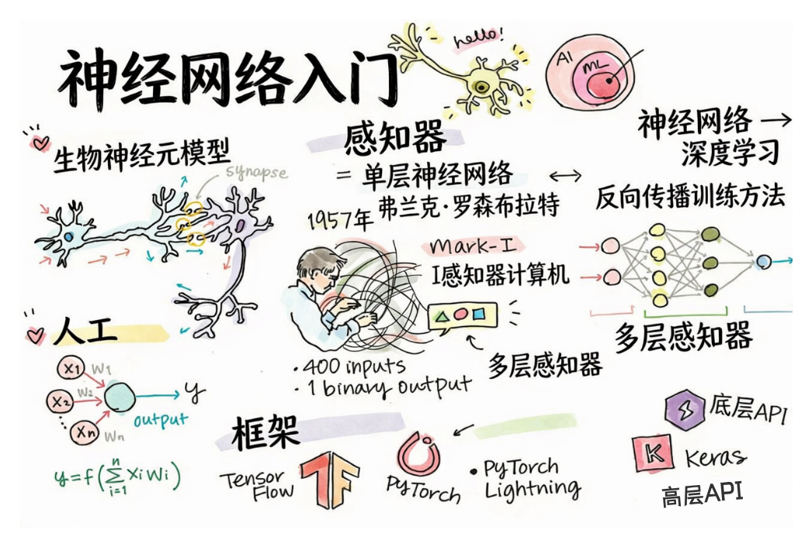

# 神经网络介绍

正如我们在介绍中讨论的，实现智能的方法之一是训练**计算机模型**或**人工大脑**。自 20 世纪中叶以来，研究人员尝试了不同的数学模型，直到近年来这个方向被证明是非常成功的。这种大脑的数学模型称为**神经网络**。

> 有时神经网络被称为*人工神经网络*，ANN，以表明我们谈论的是模型，而不是真正的神经元网络。

## 机器学习

神经网络是称为**机器学习**的更大学科的一部分，其目标是使用数据训练能够解决问题的计算机模型。机器学习构成了人工智能的很大一部分，但是，我们在本课程中不涵盖经典 ML。

> 访问我们单独的 **[机器学习初学者](http://github.com/microsoft/ml-for-beginners)** 课程以了解更多关于经典机器学习的内容。

在机器学习中，我们假设我们有一些示例数据集 **X** 和相应的输出值 **Y**。示例通常是包含**特征**的 N 维向量，输出称为**标签**。

我们将考虑两个最常见的机器学习问题：

* **分类**，我们需要将输入对象分类为两个或更多类别。
* **回归**，我们需要为每个输入样本预测一个数字。

> 当将输入和输出表示为张量时，输入数据集是大小为 M×N 的矩阵，其中 M 是样本数，N 是特征数。输出标签 Y 是大小为 M 的向量。

在本课程中，我们将只关注神经网络模型。

## 神经元模型

从生物学中，我们知道我们的大脑由神经细胞（神经元）组成，每个神经元都有多个"输入"（树突）和单个"输出"（轴突）。树突和轴突都可以传导电信号，它们之间的连接 - 称为突触 - 可以表现出不同程度的传导性，这些由神经递质调节。

 | 
----|----
真实神经元 *([图片](https://en.wikipedia.org/wiki/Synapse#/media/File:SynapseSchematic_lines.svg) 来自维基百科)* | 人工神经元 *(作者图片)*

因此，最简单的神经元数学模型包含几个输入 X1, ..., XN 和一个输出 Y，以及一系列权重 W1, ..., WN。输出计算为：

其中 f 是某个非线性**激活函数**。

> 神经元的早期模型在 Warren McCullock 和 Walter Pitts 于 1943 年发表的经典论文 [A logical calculus of the ideas immanent in nervous activity](https://www.cs.cmu.edu/~./epxing/Class/10715/reading/McCulloch.and.Pitts.pdf) 中描述。Donald Hebb 在他的书 "[The Organization of Behavior: A Neuropsychological Theory](https://books.google.com/books?id=VNetYrB8EBoC)" 中提出了训练这些网络的方法。

## 在本节中

在本节中，我们将学习：
* [感知机](03-Perceptron/README.md)，用于两类分类的最早神经网络模型之一
* [多层网络](04-OwnFramework/README.md)，配有配对笔记本 [如何构建我们自己的框架](04-OwnFramework/OwnFramework.ipynb)
* [神经网络框架](05-Frameworks/README.md)，包含以下笔记本：[PyTorch](05-Frameworks/IntroPyTorch.ipynb) 和 [Keras/Tensorflow](05-Frameworks/IntroKerasTF.ipynb)
* [过拟合](05-Frameworks#overfitting)

