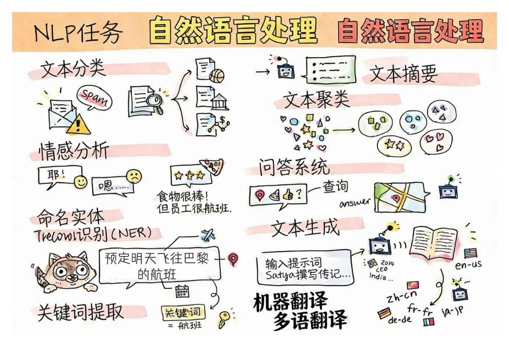

# 自然语言处理



在本节中，我们将专注于使用神经网络来处理与**自然语言处理（NLP）**相关的任务。有许多我们希望计算机能够解决的 NLP 问题：

* **文本分类**是与文本序列相关的典型分类问题。示例包括将电子邮件消息分类为垃圾邮件与非垃圾邮件，或将文章分类为体育、商业、政治等。此外，在开发聊天机器人时，我们经常需要理解用户想要说什么 - 在这种情况下，我们处理的是**意图分类**。通常，在意图分类中，我们需要处理许多类别。
* **情感分析**是典型的回归问题，我们需要为句子含义的积极/消极程度分配一个数字（情感）。情感分析的更高级版本是**基于方面的情感分析**（ABSA），我们将情感不是归因于整个句子，而是归因于它的不同部分（方面），例如 *在这家餐厅，我喜欢美食，但氛围很糟糕*。
* **命名实体识别**（NER）是指从文本中提取某些实体的问题。例如，我们可能需要理解在短语 *我明天需要飞往巴黎* 中，单词 *明天* 指的是 DATE，而 *巴黎* 是 LOCATION。
* **关键词提取**类似于 NER，但我们需要自动提取对句子含义重要的单词，而无需针对特定实体类型进行预训练。
* **文本聚类**在我们想要将相似的句子分组在一起时很有用，例如，技术支持对话中的相似请求。
* **问答**是指模型回答特定问题的能力。模型接收文本段落和问题作为输入，它需要提供文本中包含问题答案的位置（或者，有时，生成答案文本）。
* **文本生成**是模型生成新文本的能力。它可以被视为基于某个*文本提示*预测下一个字母/单词的分类任务。高级文本生成模型，如 GPT-3，能够使用称为[提示编程](https://towardsdatascience.com/software-3-0-how-prompting-will-change-the-rules-of-the-game-a982fbfe1e0)或[提示工程](https://medium.com/swlh/openai-gpt-3-and-prompt-engineering-dcdc2c5fcd29)的技术解决其他 NLP 任务，如分类
* **文本摘要**是一种技术，当我们希望计算机"阅读"长文本并用几句话总结它时。
* **机器翻译**可以看作是一种语言的文本理解和另一种语言的文本生成的组合。

最初，大多数 NLP 任务都是使用传统方法（如语法）解决的。例如，在机器翻译中，使用解析器将初始句子转换为语法树，然后提取更高级的语义结构以表示句子的含义，并基于此含义和目标语言的语法生成结果。如今，许多 NLP 任务使用神经网络更有效地解决。

> 许多经典 NLP 方法在 [自然语言处理工具包（NLTK）](https://www.nltk.org) Python 库中实现。有一本很棒的 [NLTK 书籍](https://www.nltk.org/book/)在线提供，涵盖了如何使用 NLTK 解决不同的 NLP 任务。

在我们的课程中，我们将主要专注于使用神经网络进行 NLP，并在需要时使用 NLTK。

我们已经学习了使用神经网络处理表格数据和图像。这些类型的数据和文本之间的主要区别是文本是可变长度的序列，而图像情况下的输入大小是预先知道的。虽然卷积网络可以从输入数据中提取模式，但文本中的模式更复杂。例如，我们可以有否定与主体分离，对于许多单词来说是任意的（例如 *我不喜欢橙子* vs. *我不喜欢那些大而多彩的美味橙子*），这仍然应该被解释为一个模式。因此，为了处理语言，我们需要引入新的神经网络类型，如*循环网络*和*transformer*。

## 安装库

如果您使用本地 Python 安装来运行本课程，您可能需要使用以下命令安装 NLP 所需的所有库：

**对于 PyTorch**
```bash
pip install -r requirements-torch.txt
```
**对于 TensorFlow**
```bash
pip install -r requirements-tf.txt
```

> 您可以在 [Microsoft Learn](https://docs.microsoft.com/learn/modules/intro-natural-language-processing-tensorflow/?WT.mc_id=academic-77998-cacaste) 上尝试使用 TensorFlow 进行 NLP

## GPU 警告

在本节中，在一些示例中，我们将训练相当大的模型。
* **使用支持 GPU 的计算机**：建议在支持 GPU 的计算机上运行您的笔记本，以减少使用大型模型时的等待时间。
* **GPU 内存限制**：在 GPU 上运行可能会导致 GPU 内存不足的情况，尤其是在训练大型模型时。
* **GPU 内存消耗**：训练期间消耗的 GPU 内存量取决于各种因素，包括小批量大小。
* **最小化小批量大小**：如果您遇到 GPU 内存问题，请考虑减少代码中的小批量大小作为潜在的解决方案。
* **TensorFlow GPU 内存释放**：旧版本的 TensorFlow 在一个 Python 内核中训练多个模型时可能无法正确释放 GPU 内存。为了有效管理 GPU 内存使用，您可以配置 TensorFlow 仅在需要时分配 GPU 内存。
* **代码包含**：要将 TensorFlow 设置为仅在需要时增长 GPU 内存分配，请在您的笔记本中包含以下代码：

```python
physical_devices = tf.config.list_physical_devices('GPU') 
if len(physical_devices)>0:
    tf.config.experimental.set_memory_growth(physical_devices[0], True) 
```

如果您有兴趣从经典 ML 的角度学习 NLP，请访问[这套课程](https://github.com/microsoft/ML-For-Beginners/tree/main/6-NLP)

## 在本节中
在本节中，我们将学习：

* [将文本表示为张量](13-TextRep/README.md)
* [词嵌入](14-Emdeddings/README.md)
* [语言建模](15-LanguageModeling/README.md)
* [循环神经网络](16-RNN/README.md)
* [生成网络](17-GenerativeNetworks/README.md)
* [Transformer](18-Transformers/README.md)

